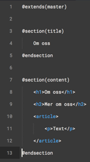

# Static-HTML-Generator
This project was created to simplify work with assignments in a basic web development course where server-side rendering, and thus code sharing, was not an option.

The purpose is to help avoding repetition of code that is shared between several pages, e.g. hedaer, navigation and footer, while still generating static html-pages that will pass the course requirements.

# How to use

1. Add `generator.js` in the `dist` directory to your project root directory.

2. Create a directory `layouts` and create an html-file (e.g. master.html) that will work as the template for all pages. Since the content of this file is part of the assignment, I will not show a complete example here, but all you need is a complete standard HTML-file, and where content differs on different pages, use a yield-directive with `@yield(name)`.
For instance `@yield(title)` in the title-tag, and `@yield(content)` after navigation.

3. Create a directory `pages` where you place each page html-file. The first line in these files will specify what layout to use using the extends-directive, e.g. `@extends(master)`.
Page-specific content is then added in the corresponding sections, using `@section(content)` and `@endsection`.
An about.html-file could look like this:

   

4. Relative urls are generated correctly using the @link(name), @css(name) and @js(name) directives. This is necessary since index.html will be placed in the root directory whereas the other pages are placed in the html-directory (according to the course requirements).
For example:

    `<link rel="stylesheet" href="@css(style)">`

    ``

5. The `active:name` directive will be rewritten to `active` if the current file corresponds to `name`(without .html) and the empty string otherwise. This can be useful to add an active-class to the current page in the navigation.
For example: `<li><a class="active:index" href="@link(index)">Start</a></li>`

6. Run `node generator.js`to generate the static html-files. All files found in `pages/` will be generated and put in the html-directory, exceot for index.html which will be placed in the root folder (but index.html should still be put in pages/).

That's it. Just make sure you update the layout- and pages-files, and not the generated files, and you will save lots of time and avoid problems with broken links and different pages showing different versions of the navigation.

# A few ceveats

* `node generator.js` must be run after each change to a layout- or pages-file. This should be solved with a simple watcher.

* The `html`-folder need to be created manually before the first run. This will be fixed soon.

* The syntaxen is inspired by Laravel Blade, but feel free to suggest other conventions/directive-naming.

* I have not written any tests yet and I will avoid larger refactoring until these are in place (feel fre to PR!)

* This a very early version and the API is likely to change.

# Contributions
This is mostly a toy-project to help me with this specific course-assignment, but it's now also a great way to play around with GitHub. Please feel free to use this repo in the same way, i.e. you're welcome to create PRs, Issues etc. even if you're unsure if you've done it "correctly".
